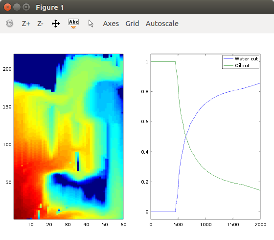

## Reference:
- Geometric Modelling, Numerical Simulation, and Optimization pp 265-306
An Introduction to the Numerics of Flow in Porous Media using Matlab
  - Authors: Jørg E. Aarnes, Tore Gimse, Knut-Andreas Lie
  - DOI https://doi.org/10.1007/978-3-540-68783-2_9
- SPE-10 data: https://www.spe.org/web/csp/index.html
  - Ordering of i,j,k and kx,ky,kz are unkown. Data might not be in correct order

  
```octave
oned = reshape(spe_perm', [1 561000*6]);
%KU = 3x60x220x1 array
%pU = 60*220*1 array

Kx = zeros(60,220,1);
Ky = zeros(60,220,1);
Kz = zeros(60,220,1);
n=0;
for k=1:1
  for j=1:220
    for i=1:60
      n = n + 1;
      Kx(i,j,k) = oned(n); 
      Ky(i,j,k) = oned(n+60*220*85);
      Kx(i,j,k) = oned(n+60*220*85*2);
    end
  end
end
KU = zeros(3,60,220,1);
KU(1,:,:,:) = Kx;
KU(2,:,:,:) = Ky;
KU(3,:,:,:) = Kz;
%
oned = reshape(spe_phi', [1 187000*6]);
pU= zeros(60,220,1);
n=0;
for k=1:1
  for j=1:220
    for i=1:60
      n = n + 1;
      pU(i,j,k) = oned(n); 
    end
  end
end
save Udata.mat KU pU
```
## Sample run
- Run list_11 from Octave Command window

- plot(prop.nl_it) # plotting nonlinear iterations

## Change of the linear solver
- In the sample code, linear solver is done by mldvidie (A\b)
- This is LU decomposition (?) and way faster than iterative methods for this example
- Sample iterative solver is tested using gmres() but it would be 150x slower than the default
  - Using ilu() preconditioner reduces the number gmres iterations as 10% but wall time doesnt's show much differences
- Default - 8.7 sec
- Gmres with preconditioner - 797sec
- Inexact Newton - 783sec